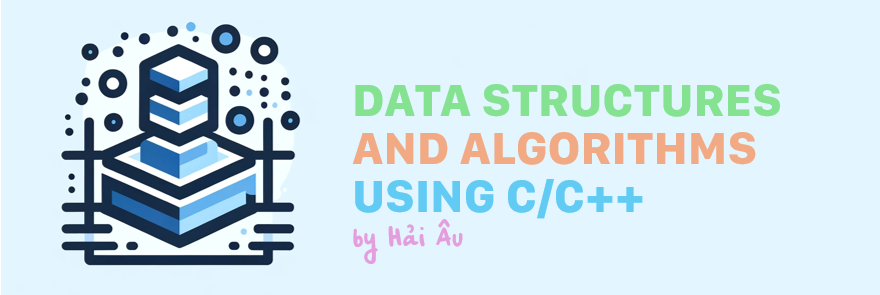

# Cấu trúc dữ liệu và Thuật toán - Ngôn ngữ C/C++

Chào mừng bạn đến với kho lưu trữ đáng yêu này ~ Đây là một tập hợp các bài giảng, ví dụ mã nguồn, và bài tập liên quan đến việc học và thực hành *cấu trúc dữ liệu* và *thuật toán* sử dụng ngôn ngữ lập trình C/C++. Cấu trúc dữ liệu và thuật toán là những khái niệm cơ bản nhưng vô cùng quan trọng trong lập trình, đóng vai trò là nền tảng cho các chương trình máy tính.

* **Cấu trúc dữ liệu** là cách tổ chức, quản lý và lưu trữ dữ liệu để nó có thể được sử dụng hiệu quả. Có nhiều loại cấu trúc dữ liệu khác nhau, từ những cấu trúc cơ bản như mảng (array), danh sách liên kết (linked list), ngăn xếp (stack), và hàng đợi (queue), đến những cấu trúc dữ liệu phức tạp hơn như cây (tree), bảng băm (hash table), và đồ thị (graph). Việc lựa chọn cấu trúc dữ liệu phù hợp là chìa khóa để giải quyết vấn đề một cách hiệu quả.
* **Thuật toán** là một tập hợp các bước thực hiện được xác định rõ ràng, nhằm giải quyết một vấn đề hoặc thực hiện một nhiệm vụ cụ thể. Nó giống như một công thức hoặc một kế hoạch hành động, chi tiết từng bước cần thiết để từ một hoặc nhiều đầu vào, ta có thể đạt được kết quả mong muốn. Thuật toán có thể được biểu diễn thông qua ngôn ngữ tự nhiên, sơ đồ, hoặc ngôn ngữ lập trình, và chúng phải đảm bảo tính đúng đắn, hiệu quả về thời gian và tài nguyên sử dụng.

## Vì sao tôi chọn ngôn ngữ lập trình C/C++?

Ngôn ngữ C và C++ là lựa chọn phổ biến cho việc học và ứng dụng cấu trúc dữ liệu và thuật toán vì nhiều lý do:

* *Chúng có hiệu suất cao*. C và C++ là ngôn ngữ lập trình cấp thấp hơn so với những ngôn ngữ bậc cao khác, giúp chúng có hiệu suất cao và gần gũi với phần cứng.
* *Khả năng kiểm soát tài nguyên*. C/C++ cung cấp khả năng kiểm soát tài nguyên hệ thống mạnh mẽ, bao gồm quản lý bộ nhớ thủ công, một yếu tố quan trọng trong việc hiểu rõ và tối ưu hóa cấu trúc dữ liệu.
* *Là nền tảng phát triển phần mềm*, nhiều hệ điều hành, trình biên dịch, và hệ thống được viết hoặc hỗ trợ bởi C/C++, làm cho việc học hai ngôn ngữ này trở thành bước đệm quan trọng cho sự phát triển chuyên nghiệp.

## Lộ trình học tập

Chương trình học này được thiết kế để dẫn dắt bạn từ cơ bản đến nâng cao, nắm vững những khái niệm và kỹ thuật quan trọng nhất trong lĩnh vực lập trình. Mỗi tuần, bạn sẽ tập trung vào một hoặc nhiều chủ đề cụ thể, bắt đầu từ nền tảng, xây dựng lên những kiến thức phức tạp hơn.

| **Tuần** | **Nội dung**                      | **Tóm tắt**                                                                                        |
|:--------:|-----------------------------------|----------------------------------------------------------------------------------------------------|
|          | Introduction                      | - Giới thiệu một số khái niệm cơ bản trong C/C++. - Đưa ra các lưu ý về kỹ thuật lập trình.     |
|          | Practice                          | - Nơi tôi triển khai một số thuật toán phổ biến. - Chủ yếu lưu trữ những nội dung thú vị.       |
|     1    | [Recursion, Backtracking](/Week%201%20-%20Recursion,%20Backtracking/Recursion%20&%20Backtracking.md)           | - Thuật toán Đệ quy. - Thuật toán Quay lui.                                                     |
|     2    | Brach and Bound, Greedy Algorithm | - Thuật toán Nhánh cận, duyệt không gian trạng thái. - Thuật toán Tham lam cho bài toán tối ưu. |
|     3    | Dynamic Programming               | - Thuật toán Quy hoạch động.                                                                       |
|     4    | Linked List                       | - Danh sách liên kết.                                                                           |
|     5    | Stack, Queue, Deque               | - Ngăn xếp. - Hàng đợi. - Hàng đợi đôi.                                                        |
|     6    | Heap, Priority Queue              | - Khối xếp. - Hàng đợi ưu tiên.                                                                   |

## Tài liệu tham khảo

Dưới đây là một số cuốn sách tôi sử dụng cho việc học tập, hãy tham khảo để có thêm những thông tin hữu ích. Nghiền ngẫm chúng cùng lúc với khi xem xét kho lưu trữ này để có hiệu quả tốt nhất nhé ~

* Michael T. Goodrich, Roberto Tamassia, David M. Mount; *Data Structures and Algorithms in C++*; Second Edition.
* Alexander Shen; *Algorithms and Programming: Problems and Solutions*; Second Edition.
* Antti Laaksonen; *Guide to Competitive Programming: Learning and Improving Algorithms Through Contests*.
* Robert C. Seacord; *Effective C: An Introduction to Professional C Programming*.
